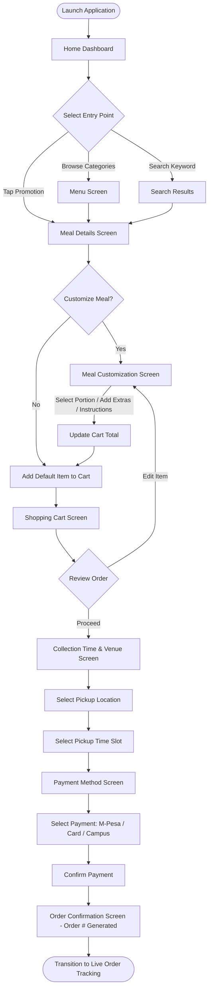
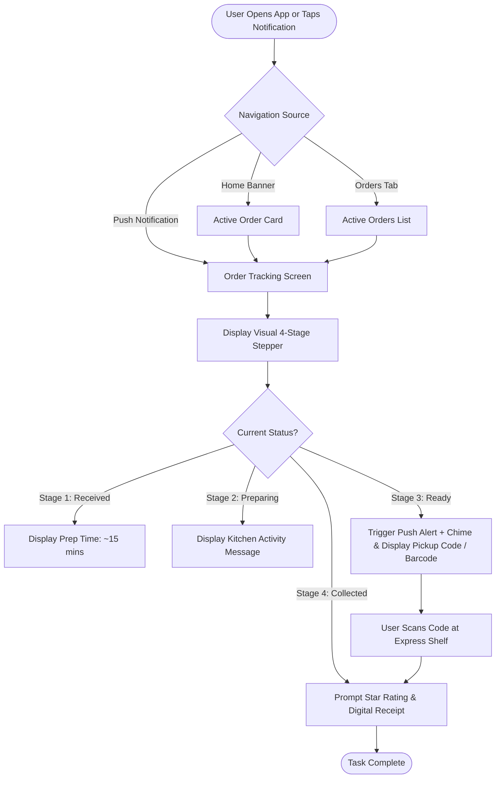
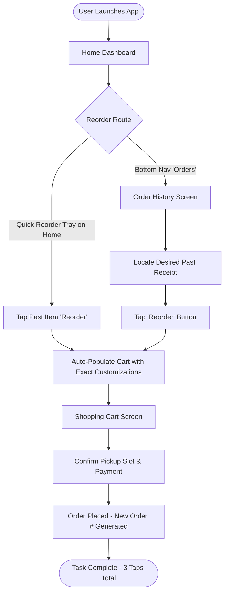

# Task Flows
## Smart Cafeteria Ordering Mobile Application

This document outlines the operational task flows for the three core user scenarios specified in the PRD.

---

### Scenario 1: Place an Order (Primary Flow)
**Goal:** A student or staff member selects, customizes, schedules, pays for, and places a meal order.

---

### Scenario 2: Track an Active Order
**Goal:** User checks real-time preparation status and collects food upon notification.

---

### Scenario 3: Reorder a Previous Meal
**Goal:** User rapidly re-orders a past meal from history in under 3 taps.

